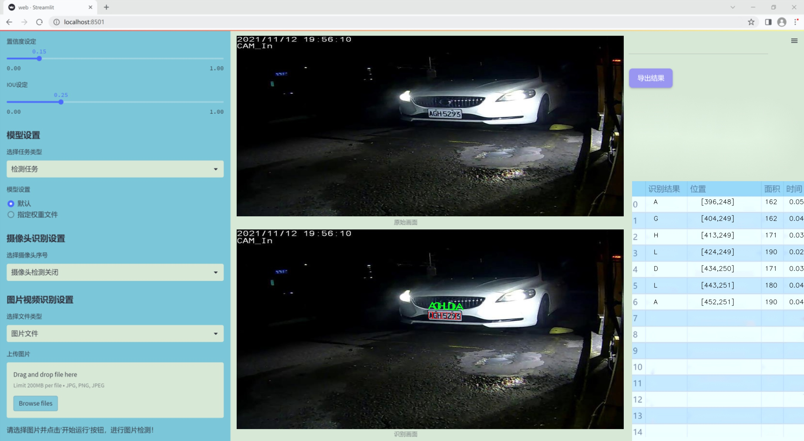
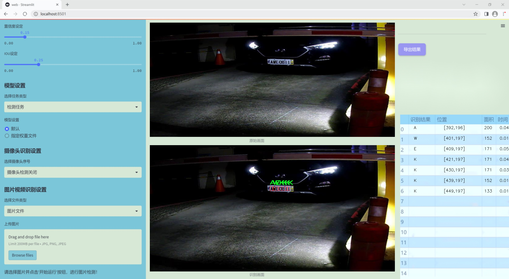
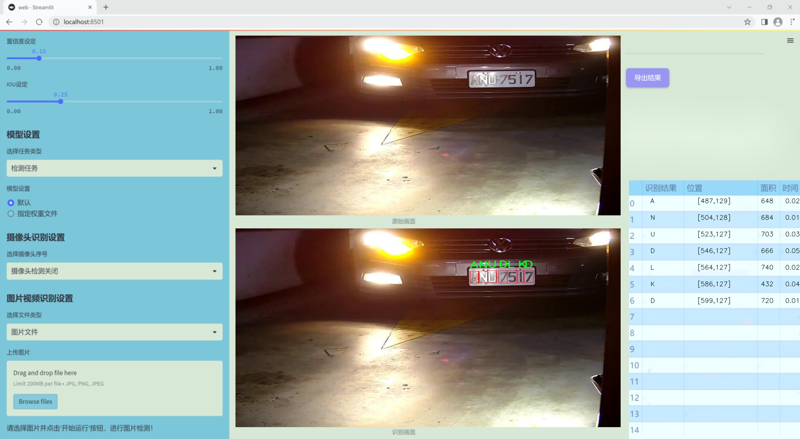
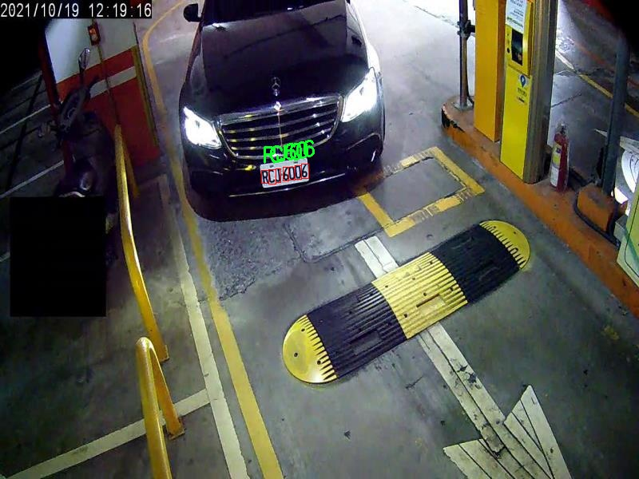
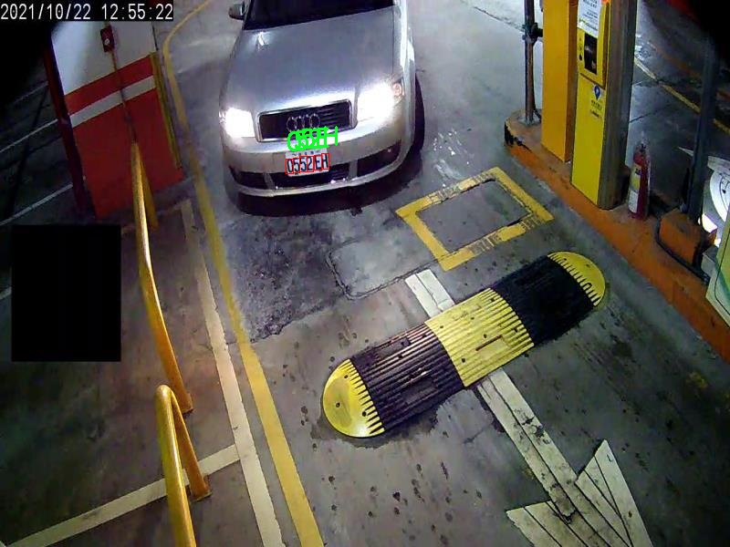
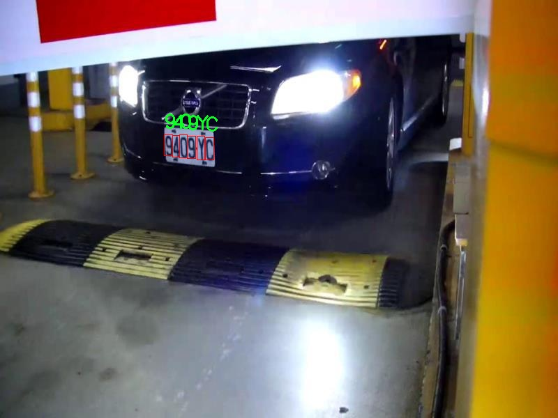
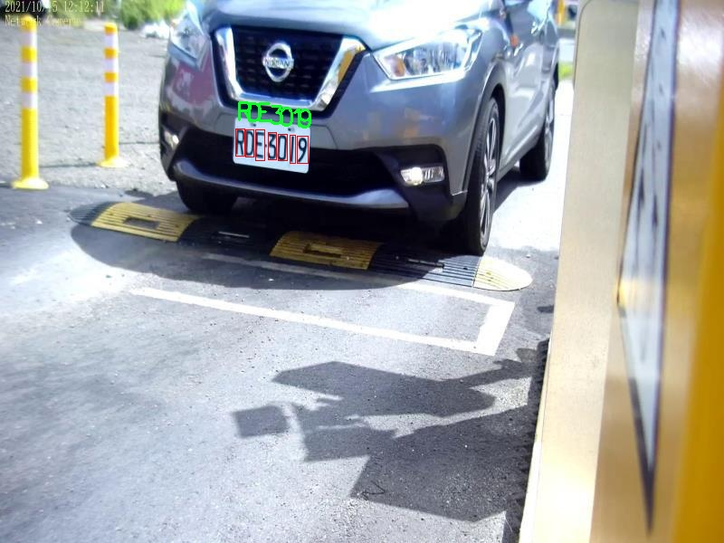
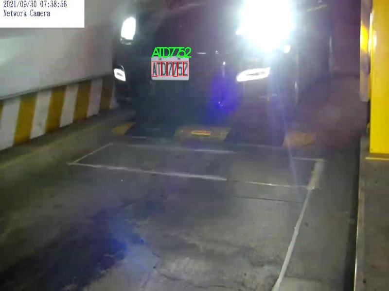

# 改进yolo11-EfficientFormerV2等200+全套创新点大全：车牌识别系统源码＆数据集全套

### 1.图片效果展示







##### 项目来源 **[人工智能促进会 2024.10.22](https://kdocs.cn/l/cszuIiCKVNis)**

##### 注意：由于项目一直在更新迭代，上面“1.图片效果展示”和“2.视频效果展示”展示的系统图片或者视频可能为老版本，新版本在老版本的基础上升级如下：（实际效果以升级的新版本为准）

  （1）适配了YOLOV11的“目标检测”模型和“实例分割”模型，通过加载相应的权重（.pt）文件即可自适应加载模型。

  （2）支持“图片识别”、“视频识别”、“摄像头实时识别”三种识别模式。

  （3）支持“图片识别”、“视频识别”、“摄像头实时识别”三种识别结果保存导出，解决手动导出（容易卡顿出现爆内存）存在的问题，识别完自动保存结果并导出到tempDir中。

  （4）支持Web前端系统中的标题、背景图等自定义修改。

  另外本项目提供训练的数据集和训练教程,暂不提供权重文件（best.pt）,需要您按照教程进行训练后实现图片演示和Web前端界面演示的效果。

### 2.视频效果展示

[2.1 视频效果展示](https://www.bilibili.com/video/BV13oyRYbE6f/)

### 3.背景

研究背景与意义

随着智能交通系统的快速发展，车牌识别技术在交通管理、智能停车、电子收费等领域得到了广泛应用。车牌识别系统的核心在于高效、准确地识别车辆的车牌信息，而这一过程通常依赖于先进的计算机视觉和深度学习技术。近年来，YOLO（You Only Look Once）系列模型因其实时性和高准确率而受到广泛关注。YOLOv11作为该系列的最新版本，具备了更强的特征提取能力和更快的处理速度，成为车牌识别领域的理想选择。

本研究旨在基于改进的YOLOv11模型，构建一个高效的车牌识别系统。为此，我们选用了包含1600张图像的数据集，涵盖了从0到9的数字以及字母A到Z的车牌字符。这一多样化的字符集为模型的训练提供了丰富的样本，有助于提高识别的准确性和鲁棒性。数据集中不仅包含了不同类型的车牌，还考虑了不同的拍摄角度、光照条件和背景环境，确保模型在实际应用中的适应性。

通过对YOLOv11模型的改进，我们将探索如何优化特征提取网络，以提高车牌字符的识别精度。此外，研究还将着重于模型的实时性，以满足智能交通系统对快速反应的需求。随着城市交通的日益复杂，车牌识别技术的准确性和效率将直接影响到交通管理的智能化水平。因此，本研究不仅具有重要的学术价值，也为实际应用提供了切实可行的解决方案，为未来智能交通的发展奠定基础。

### 4.数据集信息展示

##### 4.1 本项目数据集详细数据（类别数＆类别名）

nc: 34
names: ['0', '1', '2', '3', '4', '5', '6', '7', '8', '9', 'A', 'B', 'C', 'D', 'E', 'F', 'G', 'H', 'J', 'K', 'L', 'M', 'N', 'P', 'Q', 'R', 'S', 'T', 'U', 'V', 'W', 'X', 'Y', 'Z']


该项目为【目标检测】数据集，请在【训练教程和Web端加载模型教程（第三步）】这一步的时候按照【目标检测】部分的教程来训练

##### 4.2 本项目数据集信息介绍

本项目数据集信息介绍。本项目所使用的数据集名为“ALPR”，专门用于训练和改进YOLOv11的车牌识别系统。该数据集包含34个类别，涵盖了数字和字母的组合，具体类别包括从0到9的数字，以及从A到Z的字母。这种丰富的类别设置使得模型能够有效地识别和分类各种车牌信息，满足不同地区和国家的车牌格式需求。

在数据集的构建过程中，考虑到了车牌的多样性和复杂性，确保了数据的多样性和代表性。每个类别的样本数量经过精心设计，以便于模型在训练过程中能够获得均衡的学习机会。数据集中不仅包含清晰的车牌图像，还包括在不同光照、角度和背景下拍摄的样本，以增强模型的鲁棒性和适应性。

此外，数据集的标注工作也经过严格的审核，确保每个图像中的车牌字符都得到了准确的标注。这一过程对于训练高效的车牌识别系统至关重要，因为任何标注错误都可能导致模型性能的显著下降。通过使用“ALPR”数据集，YOLOv11能够在车牌检测和字符识别任务中实现更高的准确率和更快的处理速度，从而提升实际应用中的性能。

综上所述，“ALPR”数据集为本项目提供了坚实的基础，使得改进后的YOLOv11车牌识别系统能够在多种环境下有效工作，具备更强的识别能力和更高的实用价值。











### 5.全套项目环境部署视频教程（零基础手把手教学）

[5.1 所需软件PyCharm和Anaconda安装教程（第一步）](https://www.bilibili.com/video/BV1BoC1YCEKi/?spm_id_from=333.999.0.0&vd_source=bc9aec86d164b67a7004b996143742dc)


[5.2 安装Python虚拟环境创建和依赖库安装视频教程（第二步）](https://www.bilibili.com/video/BV1ZoC1YCEBw?spm_id_from=333.788.videopod.sections&vd_source=bc9aec86d164b67a7004b996143742dc)

### 6.改进YOLOv11训练教程和Web_UI前端加载模型教程（零基础手把手教学）

[6.1 改进YOLOv11训练教程和Web_UI前端加载模型教程（第三步）](https://www.bilibili.com/video/BV1BoC1YCEhR?spm_id_from=333.788.videopod.sections&vd_source=bc9aec86d164b67a7004b996143742dc)


按照上面的训练视频教程链接加载项目提供的数据集，运行train.py即可开始训练



     Epoch   gpu_mem       box       obj       cls    labels  img_size
     1/200     20.8G   0.01576   0.01955  0.007536        22      1280: 100%|██████████| 849/849 [14:42<00:00,  1.04s/it]
               Class     Images     Labels          P          R     mAP@.5 mAP@.5:.95: 100%|██████████| 213/213 [01:14<00:00,  2.87it/s]
                 all       3395      17314      0.994      0.957      0.0957      0.0843

     Epoch   gpu_mem       box       obj       cls    labels  img_size
     2/200     20.8G   0.01578   0.01923  0.007006        22      1280: 100%|██████████| 849/849 [14:44<00:00,  1.04s/it]
               Class     Images     Labels          P          R     mAP@.5 mAP@.5:.95: 100%|██████████| 213/213 [01:12<00:00,  2.95it/s]
                 all       3395      17314      0.996      0.956      0.0957      0.0845

     Epoch   gpu_mem       box       obj       cls    labels  img_size
     3/200     20.8G   0.01561    0.0191  0.006895        27      1280: 100%|██████████| 849/849 [10:56<00:00,  1.29it/s]
               Class     Images     Labels          P          R     mAP@.5 mAP@.5:.95: 100%|███████   | 187/213 [00:52<00:00,  4.04it/s]
                 all       3395      17314      0.996      0.957      0.0957      0.0845


###### [项目数据集下载链接](https://kdocs.cn/l/cszuIiCKVNis)

### 7.原始YOLOv11算法讲解

##### YOLO11简介

> YOLO11源码地址：https://github.com/ultralytics/ultralytics

Ultralytics
YOLO11是一款尖端的、最先进的模型，它在之前YOLO版本成功的基础上进行了构建，并引入了新功能和改进，以进一步提升性能和灵活性。YOLO11设计快速、准确且易于使用，使其成为各种物体检测和跟踪、实例分割、图像分类以及姿态估计任务的绝佳选择。  


**YOLO11创新点如下:**

YOLO 11主要改进包括：  
`增强的特征提取`：YOLO 11采用了改进的骨干和颈部架构，增强了特征提取功能，以实现更精确的目标检测。  
`优化的效率和速度`：优化的架构设计和优化的训练管道提供更快的处理速度，同时保持准确性和性能之间的平衡。  
`更高的精度，更少的参数`：YOLO11m在COCO数据集上实现了更高的平均精度（mAP），参数比YOLOv8m少22%，使其在不影响精度的情况下提高了计算效率。  
`跨环境的适应性`：YOLO 11可以部署在各种环境中，包括边缘设备、云平台和支持NVIDIA GPU的系统。  
`广泛的支持任务`：YOLO 11支持各种计算机视觉任务，如对象检测、实例分割、图像分类、姿态估计和面向对象检测（OBB）。

**YOLO11不同模型尺寸信息：**

YOLO11 提供5种不同的型号规模模型，以满足不同的应用需求：

Model| size (pixels)| mAPval 50-95| Speed CPU ONNX (ms)| Speed T4 TensorRT10
(ms)| params (M)| FLOPs (B)  
---|---|---|---|---|---|---  
YOLO11n| 640| 39.5| 56.1 ± 0.8| 1.5 ± 0.0| 2.6| 6.5  
YOLO11s| 640| 47.0| 90.0 ± 1.2| 2.5 ± 0.0| 9.4| 21.5  
YOLO11m| 640| 51.5| 183.2 ± 2.0| 4.7 ± 0.1| 20.1| 68.0  
YOLO11l| 640| 53.4| 238.6 ± 1.4| 6.2 ± 0.1| 25.3| 86.9  
YOLO11x| 640| 54.7| 462.8 ± 6.7| 11.3 ± 0.2| 56.9| 194.9  
  
**模型常用训练超参数参数说明：**  
`YOLOv11
模型的训练设置包括训练过程中使用的各种超参数和配置`。这些设置会影响模型的性能、速度和准确性。关键的训练设置包括批量大小、学习率、动量和权重衰减。此外，优化器、损失函数和训练数据集组成的选择也会影响训练过程。对这些设置进行仔细的调整和实验对于优化性能至关重要。  
**以下是一些常用的模型训练参数和说明：**

参数名| 默认值| 说明  
---|---|---  
`model`| `None`| 指定用于训练的模型文件。接受指向 `.pt` 预训练模型或 `.yaml`
配置文件。对于定义模型结构或初始化权重至关重要。  
`data`| `None`| 数据集配置文件的路径（例如
`coco8.yaml`).该文件包含特定于数据集的参数，包括训练数据和验证数据的路径、类名和类数。  
`epochs`| `100`| 训练总轮数。每个epoch代表对整个数据集进行一次完整的训练。调整该值会影响训练时间和模型性能。  
`patience`| `100`| 在验证指标没有改善的情况下，提前停止训练所需的epoch数。当性能趋于平稳时停止训练，有助于防止过度拟合。  
`batch`| `16`| 批量大小，有三种模式:设置为整数(例如，’ Batch =16 ‘)， 60% GPU内存利用率的自动模式(’ Batch
=-1 ‘)，或指定利用率分数的自动模式(’ Batch =0.70 ')。  
`imgsz`| `640`| 用于训练的目标图像尺寸。所有图像在输入模型前都会被调整到这一尺寸。影响模型精度和计算复杂度。  
`device`| `None`| 指定用于训练的计算设备：单个 GPU (`device=0`）、多个 GPU (`device=0,1`)、CPU
(`device=cpu`)，或苹果芯片的 MPS (`device=mps`).  
`workers`| `8`| 加载数据的工作线程数（每 `RANK` 多 GPU 训练）。影响数据预处理和输入模型的速度，尤其适用于多 GPU 设置。  
`name`| `None`| 训练运行的名称。用于在项目文件夹内创建一个子目录，用于存储训练日志和输出结果。  
`pretrained`| `True`| 决定是否从预处理模型开始训练。可以是布尔值，也可以是加载权重的特定模型的字符串路径。提高训练效率和模型性能。  
`optimizer`| `'auto'`| 为训练模型选择优化器。选项包括 `SGD`, `Adam`, `AdamW`, `NAdam`,
`RAdam`, `RMSProp` 等，或 `auto` 用于根据模型配置进行自动选择。影响收敛速度和稳定性  
`lr0`| `0.01`| 初始学习率（即 `SGD=1E-2`, `Adam=1E-3`) .调整这个值对优化过程至关重要，会影响模型权重的更新速度。  
`lrf`| `0.01`| 最终学习率占初始学习率的百分比 = (`lr0 * lrf`)，与调度程序结合使用，随着时间的推移调整学习率。  


**各损失函数作用说明：**  
`定位损失box_loss`：预测框与标定框之间的误差（GIoU），越小定位得越准；  
`分类损失cls_loss`：计算锚框与对应的标定分类是否正确，越小分类得越准；  
`动态特征损失（dfl_loss）`：DFLLoss是一种用于回归预测框与目标框之间距离的损失函数。在计算损失时，目标框需要缩放到特征图尺度，即除以相应的stride，并与预测的边界框计算Ciou
Loss，同时与预测的anchors中心点到各边的距离计算回归DFLLoss。  


### 8.200+种全套改进YOLOV11创新点原理讲解

#### 8.1 200+种全套改进YOLOV11创新点原理讲解大全

由于篇幅限制，每个创新点的具体原理讲解就不全部展开，具体见下列网址中的改进模块对应项目的技术原理博客网址【Blog】（创新点均为模块化搭建，原理适配YOLOv5~YOLOv11等各种版本）

[改进模块技术原理博客【Blog】网址链接](https://gitee.com/qunmasj/good)


#### 8.2 精选部分改进YOLOV11创新点原理讲解

###### 这里节选部分改进创新点展开原理讲解(完整的改进原理见上图和[改进模块技术原理博客链接](https://gitee.com/qunmasj/good)【如果此小节的图加载失败可以通过CSDN或者Github搜索该博客的标题访问原始博客，原始博客图片显示正常】
### CBAM空间注意力机制
近年来，随着深度学习研究方向的火热，注意力机制也被广泛地应用在图像识别、语音识别和自然语言处理等领域，注意力机制在深度学习任务中发挥着举足轻重的作用。注意力机制借鉴于人类的视觉系统，例如，人眼在看到一幅画面时，会倾向于关注画面中的重要信息，而忽略其他可见的信息。深度学习中的注意力机制和人类视觉的注意力机制相似，通过扫描全局数据，从大量数据中选择出需要重点关注的、对当前任务更为重要的信息，然后对这部分信息分配更多的注意力资源，从这些信息中获取更多所需要的细节信息，而抑制其他无用的信息。而在深度学习中，则具体表现为给感兴趣的区域更高的权重，经过网络的学习和调整，得到最优的权重分配，形成网络模型的注意力，使网络拥有更强的学习能力，加快网络的收敛速度。
注意力机制通常可分为软注意力机制和硬注意力机制[4-5]。软注意力机制在选择信息时，不是从输入的信息中只选择1个，而会用到所有输入信息，只是各个信息对应的权重分配不同，然后输入网络模型进行计算;硬注意力机制则是从输入的信息中随机选取一个或者选择概率最高的信息，但是这一步骤通常是不可微的，导致硬注意力机制更难训练。因此，软注意力机制应用更为广泛，按照原理可将软注意力机制划分为:通道注意力机制（channel attention)、空间注意力机制(spatial attention）和混合域注意力机制(mixed attention)。
通道注意力机制的本质建立各个特征通道之间的重要程度，对感兴趣的通道进行重点关注，弱化不感兴趣的通道的作用;空间注意力的本质则是建模了整个空间信息的重要程度，然后对空间内感兴趣的区域进行重点关注，弱化其余非感兴趣区域的作用;混合注意力同时运用了通道注意力和空间注意力，两部分先后进行或并行，形成对通道特征和空间特征同时关注的注意力模型。

卷积层注意力模块(Convolutional Block Attention Module，CBAM）是比较常用的混合注意力模块，其先后集中了通道注意力模块和空间注意力模块，网络中加入该模块能有效提高网络性能，减少网络模型的计算量，模块结构如图所示。输入特征图首先经过分支的通道注意力模块，然后和主干的原特征图融合，得到具有通道注意力的特征图，接着经过分支的空间注意力模块，在和主干的特征图融合后，得到同时具有通道特征注意力和空间特征注意力的特征图。CBAM模块不改变输入特征图的大小，因此该模块是一个“即插即用”的模块，可以插入网络的任何位置。

通道注意力模块的结构示意图如图所示，通道注意力模块分支并行地对输入的特征图进行最大池化操作和平均池化操作，然后利用多层感知机对结果进行变换，得到应用于两个通道的变换结果，最后经过sigmoid激活函数将变换结果融合，得到具有通道注意力的通道特征图。

空间注意力模块示意图如图所示，将通道注意力模块输出的特征图作为该模块的输入特征图，首先对输入特征图进行基于通道的最大池化操作和平均池化操作，将两部分得到的结果拼接起来，然后通过卷积得到降为Ⅰ通道的特征图，最后通过sigmoid激活函数生成具有空间注意力的特征图。


### 9.系统功能展示

图9.1.系统支持检测结果表格显示

  图9.2.系统支持置信度和IOU阈值手动调节

  图9.3.系统支持自定义加载权重文件best.pt(需要你通过步骤5中训练获得)

  图9.4.系统支持摄像头实时识别

  图9.5.系统支持图片识别

  图9.6.系统支持视频识别

  图9.7.系统支持识别结果文件自动保存

  图9.8.系统支持Excel导出检测结果数据


### 10. YOLOv11核心改进源码讲解

#### 10.1 test_selective_scan_easy.py

以下是对代码的核心部分进行分析和详细注释的结果。为了便于理解，我将代码的核心功能和结构进行了简化，并添加了详细的中文注释。

```python
import torch
import torch.nn.functional as F

def selective_scan_easy(us, dts, As, Bs, Cs, Ds, delta_bias=None, delta_softplus=False, return_last_state=False, chunksize=64):
    """
    选择性扫描函数，进行时间序列的状态更新和输出计算。
    
    参数：
    us: 输入张量，形状为 (B, G * D, L)
    dts: 时间增量张量，形状为 (B, G * D, L)
    As: 状态转移矩阵，形状为 (G * D, N)
    Bs: 输入权重矩阵，形状为 (B, G, N, L)
    Cs: 输出权重矩阵，形状为 (B, G, N, L)
    Ds: 状态偏置，形状为 (G * D)
    delta_bias: 可选的偏置调整，形状为 (G * D)
    delta_softplus: 是否对时间增量应用softplus激活
    return_last_state: 是否返回最后的状态
    chunksize: 每次处理的时间步长
    """
    
    def selective_scan_chunk(us, dts, As, Bs, Cs, hprefix):
        """
        处理每个时间块的选择性扫描。
        
        参数：
        us: 当前输入块
        dts: 当前时间增量块
        As: 状态转移矩阵
        Bs: 输入权重矩阵
        Cs: 输出权重矩阵
        hprefix: 前一个状态的输出
        
        返回：
        ys: 当前块的输出
        hs: 当前块的状态
        """
        ts = dts.cumsum(dim=0)  # 计算时间增量的累积和
        Ats = torch.einsum("gdn,lbgd->lbgdn", As, ts).exp()  # 计算状态转移的指数
        rAts = Ats  # 归一化处理
        duts = dts * us  # 计算输入与时间增量的乘积
        dtBus = torch.einsum("lbgd,lbgn->lbgdn", duts, Bs)  # 计算输入权重
        hs_tmp = rAts * (dtBus / rAts).cumsum(dim=0)  # 更新状态
        hs = hs_tmp + Ats * hprefix.unsqueeze(0)  # 加上前一个状态
        ys = torch.einsum("lbgn,lbgdn->lbgd", Cs, hs)  # 计算输出
        return ys, hs

    # 数据类型设置
    dtype = torch.float32
    us = us.view(B, G, -1, L).permute(3, 0, 1, 2).to(dtype)  # 重新排列输入
    dts = dts.view(B, G, -1, L).permute(3, 0, 1, 2).to(dtype)  # 重新排列时间增量
    As = As.view(G, -1, N).to(dtype)  # 转换状态转移矩阵
    Bs = Bs.permute(3, 0, 1, 2).to(dtype)  # 重新排列输入权重
    Cs = Cs.permute(3, 0, 1, 2).to(dtype)  # 重新排列输出权重
    Ds = Ds.view(G, -1).to(dtype) if Ds is not None else None  # 转换状态偏置

    oys = []  # 输出列表
    hprefix = us.new_zeros((B, G, D, N), dtype=dtype)  # 初始化前一个状态
    for i in range(0, L, chunksize):
        ys, hs = selective_scan_chunk(
            us[i:i + chunksize], dts[i:i + chunksize], 
            As, Bs[i:i + chunksize], Cs[i:i + chunksize], hprefix
        )
        oys.append(ys)  # 添加当前块的输出
        hprefix = hs[-1]  # 更新前一个状态

    oys = torch.cat(oys, dim=0)  # 合并所有输出
    if Ds is not None:
        oys = oys + Ds * us  # 加上状态偏置
    return oys.to(inp_dtype) if not return_last_state else (oys.to(inp_dtype), hprefix.view(B, G * D, N).float())

class SelectiveScanEasy(torch.autograd.Function):
    """
    自定义的选择性扫描函数，支持自动求导。
    """
    
    @staticmethod
    @torch.cuda.amp.custom_fwd(cast_inputs=torch.float32)
    def forward(ctx, us, dts, As, Bs, Cs, Ds, delta_bias=None, delta_softplus=False, return_last_state=False, chunksize=64):
        # 保存输入参数以备后续反向传播使用
        ctx.save_for_backward(us, dts, As, Bs, Cs, Ds, delta_bias)
        # 调用选择性扫描函数
        return selective_scan_easy(us, dts, As, Bs, Cs, Ds, delta_bias, delta_softplus, return_last_state, chunksize)

    @staticmethod
    @torch.cuda.amp.custom_bwd
    def backward(ctx, doys):
        # 反向传播计算梯度
        us, dts, As, Bs, Cs, Ds, delta_bias = ctx.saved_tensors
        # 计算梯度逻辑...
        return dus, ddts, dAs, dBs, dCs, dDs, ddelta_bias, None, None, None

# 测试函数和其他功能可以根据需要添加
```

### 代码核心部分分析：
1. **选择性扫描函数**：`selective_scan_easy` 是核心函数，负责执行选择性扫描操作。它处理输入数据，计算状态转移和输出。
2. **块处理**：`selective_scan_chunk` 函数负责处理每个时间块的计算，使用累积和和矩阵乘法来更新状态和输出。
3. **自定义自动求导**：`SelectiveScanEasy` 类继承自 `torch.autograd.Function`，实现了前向和反向传播的方法，以支持在训练过程中自动计算梯度。
4. **参数处理**：函数接受多个参数，包括输入、时间增量、状态转移矩阵等，并进行必要的维度调整和数据类型转换。

以上是对代码的核心部分的分析和注释，目的是帮助理解其功能和实现逻辑。

这个文件 `test_selective_scan_easy.py` 主要实现了一个名为 `selective_scan_easy` 的函数，该函数用于执行选择性扫描操作，通常在深度学习和时间序列处理等领域中使用。代码中使用了 PyTorch 库，利用其自动微分功能来支持反向传播。以下是对代码的逐步分析和说明。

首先，文件引入了一些必要的库，包括 `math`、`functools`、`torch`、`torch.nn.functional`、`pytest` 和 `einops`。这些库为后续的数学计算、张量操作和测试提供了支持。

接下来，定义了 `selective_scan_easy` 函数，该函数的输入参数包括多个张量和一些可选参数。具体参数如下：
- `us`、`dts`：输入张量，通常代表状态和时间增量。
- `As`、`Bs`、`Cs`、`Ds`：用于计算的权重张量。
- `delta_bias`、`delta_softplus`：可选的偏置和激活函数标志。
- `return_last_state`：是否返回最后的状态。
- `chunksize`：处理数据的块大小。

在函数内部，首先定义了一个名为 `selective_scan_chunk` 的内部函数，用于处理数据块的选择性扫描逻辑。该函数的核心计算涉及到张量的逐步累加和矩阵乘法，使用了 `torch.einsum` 来高效地进行张量操作。

接着，`selective_scan_easy` 函数会根据输入的维度和形状调整张量的格式，并进行必要的类型转换。之后，它会通过循环将输入数据分块处理，调用 `selective_scan_chunk` 函数进行计算，并将结果存储在 `oys` 中。

最后，函数会根据 `return_last_state` 的值决定返回的内容。如果需要返回最后的状态，则返回输出和最后的状态；否则，仅返回输出。

接下来，定义了一个 `SelectiveScanEasy` 类，继承自 `torch.autograd.Function`，用于实现自定义的前向和反向传播逻辑。这个类的 `forward` 方法实现了与 `selective_scan_easy` 函数相似的逻辑，但在处理过程中保存了一些中间结果，以便在反向传播时使用。反向传播的逻辑则在 `backward` 方法中实现，涉及到对输入张量的梯度计算。

此外，文件中还定义了多个版本的选择性扫描函数（如 `selective_scan_easyv2` 和 `selective_scan_easyv3`），这些版本可能在实现细节上有所不同，以优化性能或支持不同的功能。

最后，文件中包含了一个使用 `pytest` 进行单元测试的部分，定义了 `test_selective_scan` 函数。该函数使用参数化的方式测试不同输入情况下的选择性扫描功能，确保实现的正确性和稳定性。

总的来说，这个文件实现了一个复杂的选择性扫描操作，结合了深度学习中的张量计算和自动微分，适用于需要动态计算状态的场景。通过测试确保了代码的可靠性和正确性。

#### 10.2 fasternet.py

以下是经过简化并添加详细中文注释的核心代码部分：

```python
import torch
import torch.nn as nn
from typing import List
from torch import Tensor

class Partial_conv3(nn.Module):
    """
    部分卷积层，用于处理输入的特征图。
    """

    def __init__(self, dim, n_div, forward):
        super().__init__()
        self.dim_conv3 = dim // n_div  # 计算部分卷积的通道数
        self.dim_untouched = dim - self.dim_conv3  # 计算未被卷积处理的通道数
        self.partial_conv3 = nn.Conv2d(self.dim_conv3, self.dim_conv3, 3, 1, 1, bias=False)  # 定义卷积层

        # 根据前向传播方式选择不同的前向传播函数
        if forward == 'slicing':
            self.forward = self.forward_slicing
        elif forward == 'split_cat':
            self.forward = self.forward_split_cat
        else:
            raise NotImplementedError

    def forward_slicing(self, x: Tensor) -> Tensor:
        # 仅用于推理阶段
        x = x.clone()  # 克隆输入以保留原始输入
        x[:, :self.dim_conv3, :, :] = self.partial_conv3(x[:, :self.dim_conv3, :, :])  # 处理部分通道
        return x

    def forward_split_cat(self, x: Tensor) -> Tensor:
        # 用于训练和推理阶段
        x1, x2 = torch.split(x, [self.dim_conv3, self.dim_untouched], dim=1)  # 分割输入
        x1 = self.partial_conv3(x1)  # 处理部分通道
        x = torch.cat((x1, x2), 1)  # 连接处理后的通道和未处理的通道
        return x


class MLPBlock(nn.Module):
    """
    多层感知机块，包含前向传播和残差连接。
    """

    def __init__(self, dim, n_div, mlp_ratio, drop_path, layer_scale_init_value, act_layer, norm_layer, pconv_fw_type):
        super().__init__()
        self.dim = dim
        self.mlp_ratio = mlp_ratio
        self.drop_path = nn.Identity() if drop_path <= 0 else nn.Dropout(drop_path)  # 处理随机丢弃
        self.n_div = n_div

        mlp_hidden_dim = int(dim * mlp_ratio)  # 计算隐藏层维度

        # 定义多层感知机的结构
        mlp_layer: List[nn.Module] = [
            nn.Conv2d(dim, mlp_hidden_dim, 1, bias=False),
            norm_layer(mlp_hidden_dim),
            act_layer(),
            nn.Conv2d(mlp_hidden_dim, dim, 1, bias=False)
        ]

        self.mlp = nn.Sequential(*mlp_layer)  # 将MLP层组合成一个序列

        # 定义空间混合层
        self.spatial_mixing = Partial_conv3(dim, n_div, pconv_fw_type)

    def forward(self, x: Tensor) -> Tensor:
        shortcut = x  # 保存输入以进行残差连接
        x = self.spatial_mixing(x)  # 进行空间混合
        x = shortcut + self.drop_path(self.mlp(x))  # 添加残差连接
        return x


class FasterNet(nn.Module):
    """
    FasterNet主网络结构。
    """

    def __init__(self, in_chans=3, num_classes=1000, embed_dim=96, depths=(1, 2, 8, 2), mlp_ratio=2., n_div=4,
                 patch_size=4, patch_stride=4, patch_size2=2, patch_stride2=2, patch_norm=True, drop_path_rate=0.1,
                 layer_scale_init_value=0, norm_layer=nn.BatchNorm2d, act_layer=nn.ReLU):
        super().__init__()

        self.num_stages = len(depths)  # 网络阶段数量
        self.embed_dim = embed_dim  # 嵌入维度
        self.mlp_ratio = mlp_ratio  # MLP比率

        # 定义图像分块嵌入层
        self.patch_embed = nn.Conv2d(in_chans, embed_dim, kernel_size=patch_size, stride=patch_stride, bias=False)

        # 构建各个阶段的网络层
        stages_list = []
        for i_stage in range(self.num_stages):
            stage = BasicStage(dim=int(embed_dim * 2 ** i_stage), n_div=n_div, depth=depths[i_stage],
                               mlp_ratio=self.mlp_ratio, drop_path=drop_path_rate)
            stages_list.append(stage)

        self.stages = nn.Sequential(*stages_list)  # 将所有阶段组合成一个序列

    def forward(self, x: Tensor) -> Tensor:
        x = self.patch_embed(x)  # 进行图像分块嵌入
        outs = []
        for stage in self.stages:
            x = stage(x)  # 通过每个阶段
            outs.append(x)  # 保存每个阶段的输出
        return outs  # 返回所有阶段的输出


# 其他函数和模型构建函数可以根据需要进行简化
```

### 代码注释说明：
1. **Partial_conv3**: 定义了一个部分卷积层，支持两种前向传播方式（切片和拼接），用于处理输入特征图。
2. **MLPBlock**: 实现了一个多层感知机块，包含残差连接和空间混合层。
3. **FasterNet**: 主网络结构，包含多个阶段，每个阶段由多个 MLPBlock 组成，并通过图像分块嵌入层处理输入数据。

该代码片段保留了网络的核心结构和功能，同时通过注释详细解释了每个部分的作用。

这个程序文件 `fasternet.py` 实现了一个名为 FasterNet 的深度学习模型，主要用于图像处理任务。该模型由多个模块组成，包括卷积层、全连接层和一些特定的操作，以提高特征提取的效率和效果。

首先，程序导入了必要的库，包括 PyTorch 和一些其他的模块。接着定义了多个类，每个类实现了模型的不同部分。

`Partial_conv3` 类是一个特殊的卷积层，它根据不同的前向传播方式（切片或拼接）来处理输入数据。它的构造函数接受输入维度、分割数和前向传播类型作为参数。`forward_slicing` 方法用于推理阶段，保持输入的原始状态；而 `forward_split_cat` 方法则在训练和推理阶段使用，通过将输入分割成两部分，分别进行处理后再拼接。

`MLPBlock` 类实现了一个多层感知机模块，包括两个卷积层和一个激活函数。它使用了 `Partial_conv3` 进行空间混合，并在前向传播中应用了残差连接和随机深度（DropPath）策略。

`BasicStage` 类则由多个 `MLPBlock` 组成，形成一个基本的阶段。它的前向传播方法依次通过每个块处理输入。

`PatchEmbed` 和 `PatchMerging` 类用于图像的嵌入和合并操作。`PatchEmbed` 将输入图像分割成不重叠的补丁并进行卷积处理，而 `PatchMerging` 则在后续层中将特征图的维度减半。

`FasterNet` 类是整个模型的核心，构造函数中定义了模型的各个参数和层，包括嵌入层、多个基本阶段和合并层。它还根据给定的配置文件动态加载模型的参数。模型的前向传播方法输出多个阶段的特征，以便于后续的密集预测任务。

此外，程序中还定义了一些函数（如 `update_weight` 和不同版本的 `fasternet` 函数），用于加载模型权重和配置文件。这些函数会读取 YAML 配置文件，构建相应的模型，并在需要时加载预训练权重。

最后，在 `__main__` 部分，程序实例化了一个 FasterNet 模型，并打印出模型的通道信息和输入的尺寸，展示了模型的基本使用方式。

整体而言，这个程序文件展示了如何构建一个高效的图像处理模型，并提供了灵活的配置和权重加载机制，适用于各种图像处理任务。

#### 10.3 activation.py

```python
import torch
import torch.nn as nn

class AGLU(nn.Module):
    """统一激活函数模块，来源于 https://github.com/kostas1515/AGLU。"""

    def __init__(self, device=None, dtype=None) -> None:
        """初始化统一激活函数模块。"""
        super().__init__()
        # 使用Softplus作为激活函数的一部分，beta设为-1.0
        self.act = nn.Softplus(beta=-1.0)
        # 初始化lambda参数，并将其设为可学习的参数
        self.lambd = nn.Parameter(nn.init.uniform_(torch.empty(1, device=device, dtype=dtype)))  # lambda参数
        # 初始化kappa参数，并将其设为可学习的参数
        self.kappa = nn.Parameter(nn.init.uniform_(torch.empty(1, device=device, dtype=dtype)))  # kappa参数

    def forward(self, x: torch.Tensor) -> torch.Tensor:
        """计算统一激活函数的前向传播。"""
        # 将lambda参数限制在最小值0.0001，避免出现负值或零
        lam = torch.clamp(self.lambd, min=0.0001)
        # 计算激活函数的输出
        return torch.exp((1 / lam) * self.act((self.kappa * x) - torch.log(lam)))
```

### 代码核心部分说明：
1. **AGLU类**：继承自`nn.Module`，实现了一个自定义的激活函数模块。
2. **初始化方法**：
   - 使用`Softplus`作为激活函数，`beta`参数设为-1.0。
   - 定义了两个可学习的参数`lambd`和`kappa`，并通过均匀分布初始化。
3. **前向传播方法**：
   - 对`lambd`参数进行限制，确保其不小于0.0001。
   - 计算激活函数的输出，使用`torch.exp`和`self.act`进行计算。

这个程序文件名为 `activation.py`，主要实现了一个名为 AGLU 的激活函数模块。该模块是基于一个统一的激活函数，源自于 GitHub 上的一个项目。代码首先导入了 PyTorch 库及其神经网络模块。

在 `AGLU` 类的构造函数 `__init__` 中，首先调用了父类的构造函数以初始化模块。接着，定义了一个激活函数 `self.act`，这里使用的是 `Softplus` 函数，并且设置了其参数 `beta` 为 -1.0。然后，定义了两个可学习的参数 `lambd` 和 `kappa`，这两个参数的初始值是通过均匀分布随机初始化的，且可以在指定的设备和数据类型上进行初始化。

在 `forward` 方法中，定义了前向传播的计算过程。该方法接收一个张量 `x` 作为输入。首先，对 `lambd` 参数进行限制，确保其最小值为 0.0001，以避免数值不稳定。然后，计算并返回激活函数的输出，具体的计算过程涉及到 `Softplus` 函数的应用以及对 `lambd` 和 `kappa` 参数的操作。

总体而言，这个文件实现了一个自定义的激活函数模块，结合了可学习的参数，能够在神经网络中使用，以提高模型的表达能力。

#### 10.4 test_selective_scan_speed.py

以下是代码中最核心的部分，并附上详细的中文注释：

```python
import torch
import torch.nn.functional as F

def build_selective_scan_fn(selective_scan_cuda: object = None, mode="mamba_ssm", tag=None):
    """
    构建选择性扫描函数的工厂函数。
    
    参数:
    selective_scan_cuda: 用于CUDA实现的选择性扫描函数。
    mode: 选择的模式，决定使用的具体实现。
    tag: 可选的标签，用于标识不同的实现。
    
    返回:
    返回一个选择性扫描函数。
    """
    
    class SelectiveScanFn(torch.autograd.Function):
        @staticmethod
        def forward(ctx, u, delta, A, B, C, D=None, z=None, delta_bias=None, delta_softplus=False, return_last_state=False, nrows=1, backnrows=-1):
            """
            前向传播函数，执行选择性扫描操作。
            
            参数:
            ctx: 上下文对象，用于保存状态。
            u: 输入张量。
            delta: 增量张量。
            A, B, C: 系数张量。
            D: 可选的张量。
            z: 可选的张量。
            delta_bias: 可选的增量偏置。
            delta_softplus: 是否使用softplus激活。
            return_last_state: 是否返回最后的状态。
            nrows: 行数。
            backnrows: 反向传播的行数。
            
            返回:
            输出张量或输出张量和最后状态的元组。
            """
            # 确保输入张量是连续的
            if u.stride(-1) != 1:
                u = u.contiguous()
            if delta.stride(-1) != 1:
                delta = delta.contiguous()
            if D is not None:
                D = D.contiguous()
            if B.stride(-1) != 1:
                B = B.contiguous()
            if C.stride(-1) != 1:
                C = C.contiguous()
            if z is not None and z.stride(-1) != 1:
                z = z.contiguous()

            # 处理B和C的维度
            if B.dim() == 3:
                B = rearrange(B, "b dstate l -> b 1 dstate l")
                ctx.squeeze_B = True
            if C.dim() == 3:
                C = rearrange(C, "b dstate l -> b 1 dstate l")
                ctx.squeeze_C = True

            # 确保数据类型为float
            if D is not None and (D.dtype != torch.float):
                ctx._d_dtype = D.dtype
                D = D.float()
            if delta_bias is not None and (delta_bias.dtype != torch.float):
                ctx._delta_bias_dtype = delta_bias.dtype
                delta_bias = delta_bias.float()

            # 进行选择性扫描的具体实现
            if mode == "mamba_ssm":
                out, x, *rest = selective_scan_cuda.fwd(u, delta, A, B, C, D, z, delta_bias, delta_softplus)
            else:
                raise NotImplementedError("未实现的模式")

            # 保存状态以供反向传播使用
            ctx.save_for_backward(u, delta, A, B, C, D, delta_bias, x)
            last_state = x[:, :, -1, 1::2]  # 获取最后状态
            return out if not return_last_state else (out, last_state)

        @staticmethod
        def backward(ctx, dout):
            """
            反向传播函数，计算梯度。
            
            参数:
            ctx: 上下文对象，包含前向传播时保存的状态。
            dout: 输出的梯度。
            
            返回:
            输入张量的梯度。
            """
            u, delta, A, B, C, D, delta_bias, x = ctx.saved_tensors
            if dout.stride(-1) != 1:
                dout = dout.contiguous()

            # 计算反向传播的梯度
            du, ddelta, dA, dB, dC, dD, ddelta_bias = selective_scan_cuda.bwd(
                u, delta, A, B, C, D, delta_bias, dout, x, None, False
            )

            return (du, ddelta, dA, dB, dC, dD if D is not None else None, ddelta_bias if delta_bias is not None else None)

    def selective_scan_fn(u, delta, A, B, C, D=None, z=None, delta_bias=None, delta_softplus=False, return_last_state=False, nrows=1, backnrows=-1):
        """
        封装选择性扫描函数的调用。
        """
        return SelectiveScanFn.apply(u, delta, A, B, C, D, z, delta_bias, delta_softplus, return_last_state, nrows, backnrows)

    return selective_scan_fn
```

### 代码核心部分说明：
1. **构建选择性扫描函数**：`build_selective_scan_fn`函数用于创建一个选择性扫描的函数，允许使用不同的实现模式。
2. **前向传播**：`forward`方法实现了选择性扫描的核心逻辑，包括输入张量的处理、维度调整和最终的选择性扫描计算。
3. **反向传播**：`backward`方法计算梯度，支持反向传播的需求。
4. **封装函数**：`selective_scan_fn`函数是对`SelectiveScanFn`的封装，方便调用。

这些核心部分实现了选择性扫描的基本功能，并提供了必要的接口供外部调用。

这个程序文件 `test_selective_scan_speed.py` 主要用于实现和测试选择性扫描（Selective Scan）算法的性能。程序中包含了一些函数和类，主要分为前向传播和反向传播的实现，以及一些用于性能测试的代码。

首先，程序导入了一些必要的库，包括 `torch`、`torch.nn.functional`、`pytest` 和 `einops` 等。接着，定义了一个构建选择性扫描函数的工厂函数 `build_selective_scan_fn`，该函数接受一个 CUDA 实现的选择性扫描函数和一些参数，并返回一个自定义的 PyTorch 自动求导函数 `SelectiveScanFn`。

在 `SelectiveScanFn` 类中，定义了两个静态方法：`forward` 和 `backward`。`forward` 方法实现了选择性扫描的前向传播逻辑，包括对输入张量的形状和数据类型的检查、对输入数据的处理以及调用 CUDA 实现的选择性扫描函数。`backward` 方法则实现了反向传播的逻辑，计算梯度并返回相应的梯度张量。

此外，程序还定义了一些辅助函数，例如 `selective_scan_ref` 和 `selective_scan_easy`，这些函数实现了选择性扫描的参考实现和简化版本，便于后续的性能比较。

在文件的最后部分，定义了一个 `test_speed` 函数，用于测试不同选择性扫描实现的速度。该函数首先设置了一些参数，包括数据类型、批量大小、序列长度等，然后生成随机输入数据。接着，使用不同的选择性扫描实现进行多次前向和反向传播，并记录每个实现的执行时间。

通过这些测试，用户可以比较不同实现的性能，选择最适合自己需求的选择性扫描方法。整体来看，这个程序文件是一个集成了选择性扫描算法实现和性能测试的完整示例，适合用于深度学习模型中的序列数据处理。

注意：由于此博客编辑较早，上面“10.YOLOv11核心改进源码讲解”中部分代码可能会优化升级，仅供参考学习，以“11.完整训练+Web前端界面+200+种全套创新点源码、数据集获取”的内容为准。

### 11.完整训练+Web前端界面+200+种全套创新点源码、数据集获取


# [下载链接：https://mbd.pub/o/bread/Zp2bl55t](https://mbd.pub/o/bread/Zp2bl55t)